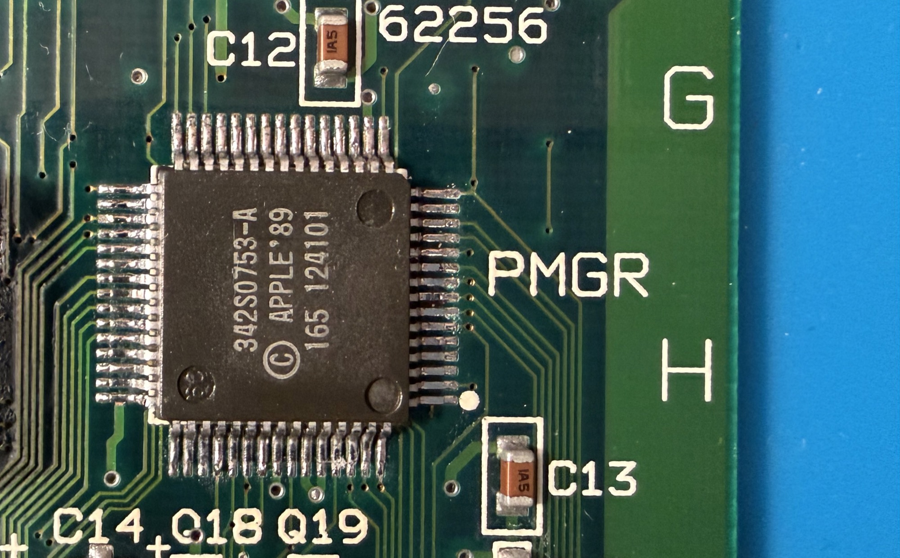
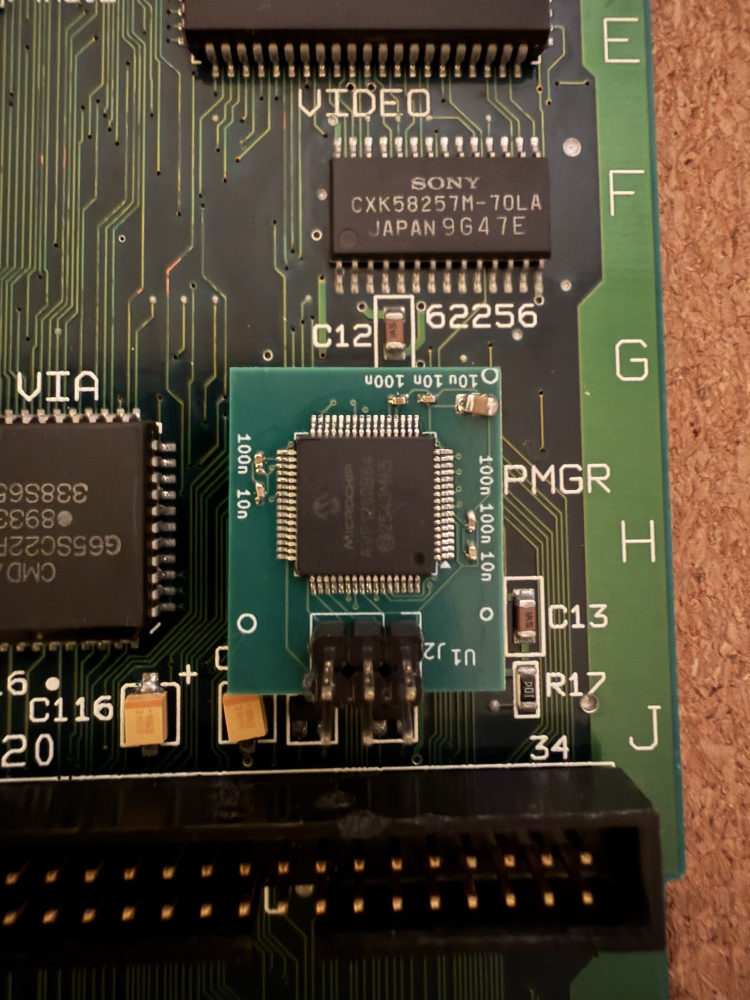
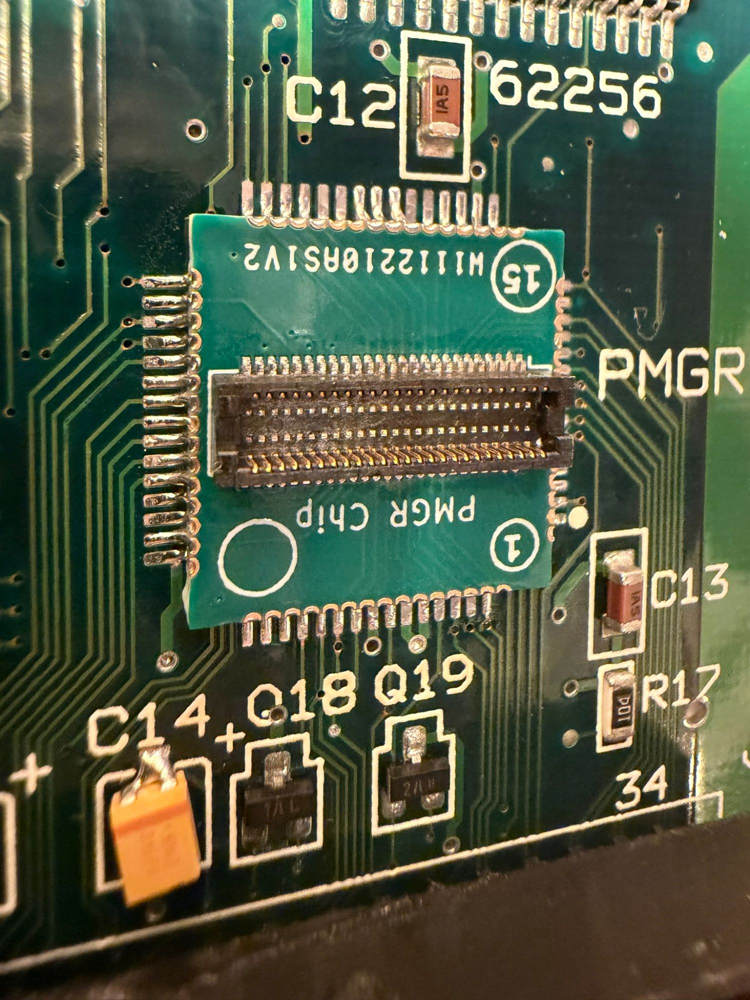
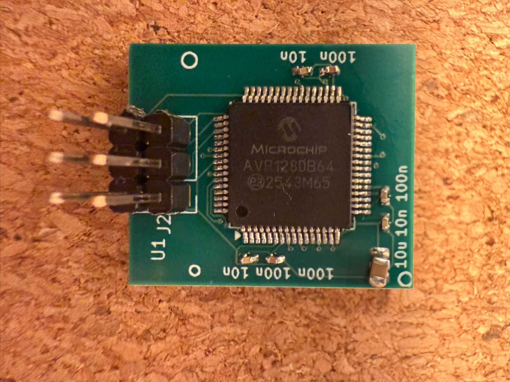
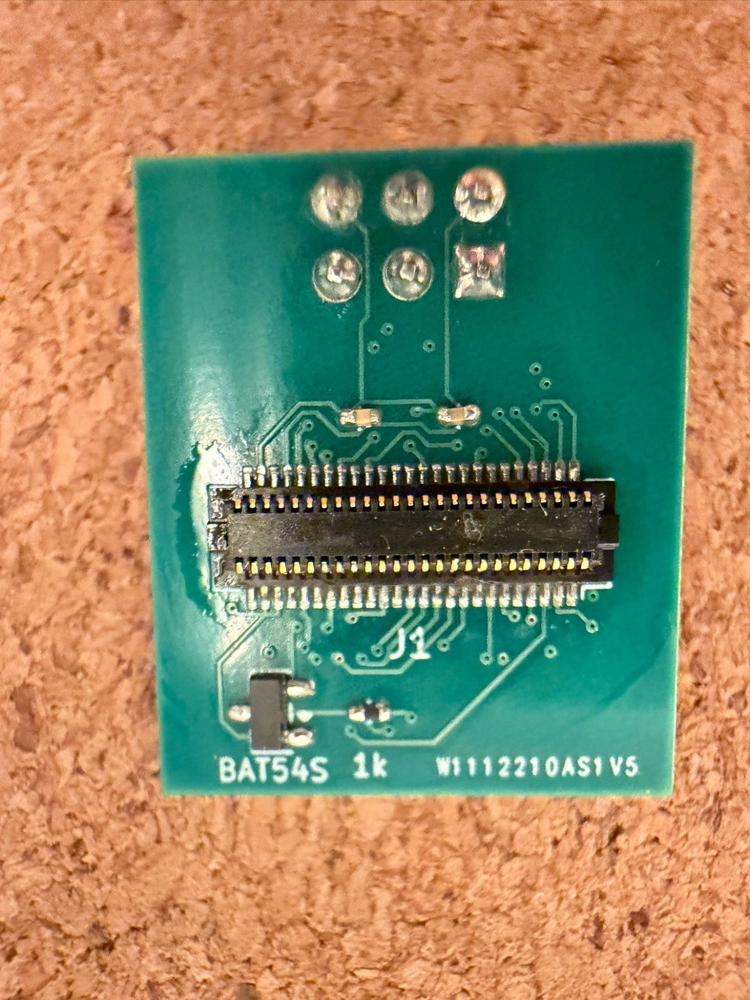

# Macintosh Portable PMGR replacement

An open replacement for the **Mitsubishi M50753 power manager (PMGR)** in the Macintosh Portable.
The original chip is irreplaceable when it fails; this is a small two-board stack that solders onto
its footprint and runs open firmware on a Microchip **AVR128DB64**, reproducing the original's
behaviour toward the Mac.

| | |
|---|---|
| **Interposer** | 16.3 mm square, castellated — solders onto the M50753's footprint on the logic board |
| **MCU board** | 20.0 × 23.5 mm — carries the AVR, plugs onto the interposer through a Hirose DF12 connector |
| **J21 breakout** *(optional)* | sits between the two for development, bringing every PMGR signal out to 2.54 mm Dupont headers |

## Photos

<table>
<tr>
<td width="50%"><br><b>Before:</b> the original M50753 (Apple 342S0753-A) at the PMGR position.</td>
<td width="50%"><br><b>After:</b> the replacement stack at the same position.</td>
</tr>
<tr>
<td><br>The interposer soldered to the original footprint. This first batch is labelled <code>PMGR Chip</code>; boards made from the current files say <code>J1</code>.</td>
<td><br>MCU board, top: the AVR128DB64 and the UPDI programming header <code>J2</code>.<br><br><br>Underside: the DF12 socket <code>J1</code>, and the <code>BAT54S</code> + 1 kΩ clamp on the battery-sense line.</td>
</tr>
</table>

## Status — version 0.1, prototype

**Working in a Macintosh Portable.** It boots, sleeps and wakes, shuts down and honours the reset
switch under System 6.0.8 and 7.5.3, and a supervised fast charge terminates correctly.

It has **only been installed and tested in a Macintosh Portable M5120** (the original, non-backlit
model), with a second, unmodified Portable kept as the reference. **The backlit Portable (M5126) has not
been tried.**

It is a **prototype**. Some parts of the charging behaviour have not been characterised on
hardware yet, and the PowerBook 100 (which uses the same PMGR) has not been tried. Read
[`docs/VERIFIED.md`](docs/VERIFIED.md) for exactly what has and has not been shown — before relying
on it unattended.

## ⛔ Safety — read before you start

- **The battery-sense input of an ORIGINAL M50753 is unprotected.** On a machine still carrying
  the original chip, never put more than **6.5 V** on the battery input while probing; over-driving
  that pin is a documented way to destroy the chip. (This design adds a clamp on that line.)
- **Never take power from the floppy connector (J15)** for accessories such as an LCD controller.
  It destroyed a PMGR during development.
- **Supervise the first charge.** The charger was designed for the original Gates/EnerSys Cyclon
  cells, which accept an unlimited initial current. Many modern substitute packs are rated far lower.
- **Every flash must re-write the calibration record** (see [`docs/BUILD.md`](docs/BUILD.md)).
  Without it the firmware deliberately refuses to fast-charge.
- **After any programmer operation — flash, fuses, even just reading the device ID — unplug the
  programmer and power-cycle the machine** (supply or battery disconnected) before expecting it to
  start. Otherwise a machine that is shut down may not wake from the keyboard. While the programmer
  is connected it **back-feeds the board**, so switching off is not a power cycle.

## Repository

```
docs/BUILD.md             start here: order, assemble, program, calibrate, install
docs/PROGRAMMING.md       building the firmware and flashing the AVR, step by step
docs/VERIFIED.md          what has been shown on hardware, and what has not
docs/REFERENCE-MEASUREMENTS.md  known-good voltages and pin references to check against
docs/ASSEMBLY.md          the detailed, bench-tested assembly procedure
docs/PINOUT.md            M50753 pin -> interposer -> AVR mapping
docs/MCU-BOARD-SCHEMATIC.md
docs/BOM.md, ORDER-LIST.md
hardware/mcu-board/       KiCad board + Gerbers
hardware/interposer-v2/   KiCad board + Gerbers
hardware/breakout-j21/    KiCad board + Gerbers + assembly files
firmware/                 AVR firmware, host-side unit tests, fuse policy
tools/                    flashing and calibration scripts
```

## The ROM image

The M50753 carries a small program ROM that the Mac can read back. **The default build contains a
synthetic image — no Apple code anywhere in this repository.** A byte-exact build is possible if you
supply your own dump of the original ROM; see [`firmware/README.md`](firmware/README.md). Never
commit that dump.

## Licences

- Hardware (`hardware/`): **CERN Open Hardware Licence v2 — Strongly Reciprocal** (`LICENSE`)
- Firmware and tools (`firmware/`, `tools/`): **MIT** (`LICENSE-MIT`)

This repository is the clean release. The full development record — every measurement, the
mistakes and their corrections — is kept separately. Questions and results from other machines are
welcome as issues; readings from original, un-modified Portables are especially useful.
