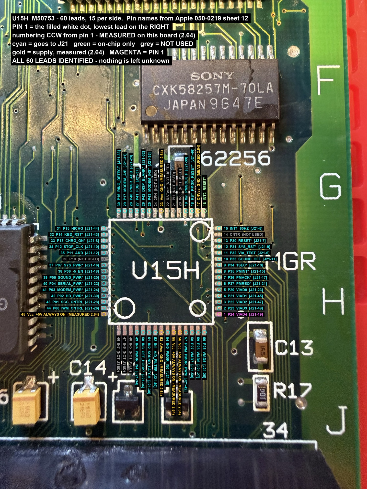
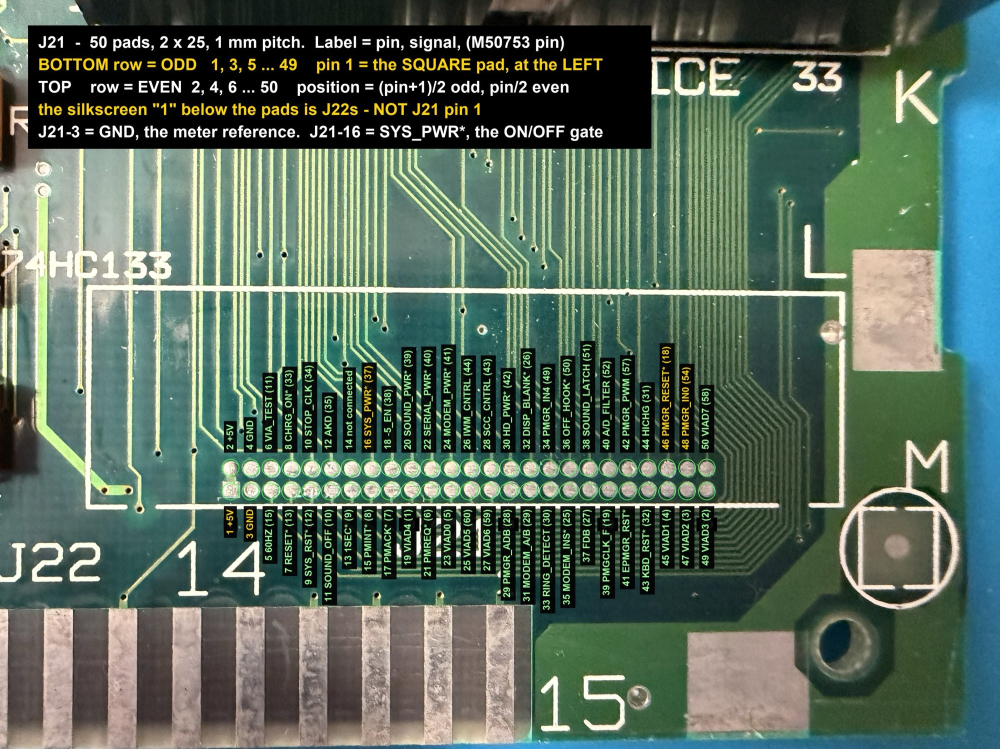
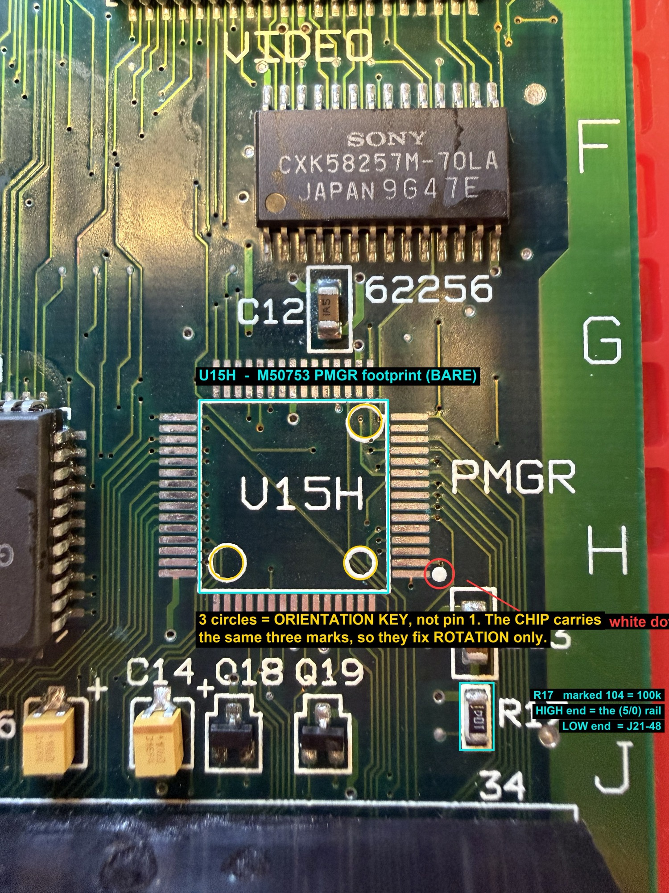
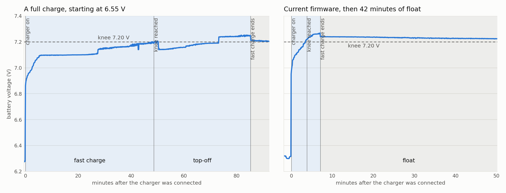

# Reference measurements

Known-good values to check your machine against. Everything here was **measured on our own two
Portables**: one fitted with this replacement, and one **unmodified** (original hybrid, original
M50753), which is the reference for anything the hybrid produces.

⚠️ One unmodified machine is a small sample. Expect your readings to differ by tens of millivolts;
a difference of tenths of a volt is worth looking into.

⛔ **On a machine with the ORIGINAL M50753, keep the battery input at or below 6.5 V while probing.**
Its battery-sense pin is unprotected.

## Pin references

**M50753 (U15H) — all 60 leads.** Pin 1 is the filled white dot, lowest lead on the right;
numbering runs counter-clockwise, confirmed by continuity on the board. Each lead is labelled with
its signal and the J21 pin it reaches.



**J21 — the 50-pad diagnostic connector** (2 × 25, 1 mm pitch). Bottom row odd, top row even;
**pin 1 is the square pad at the left.** ⚠️ The silkscreen "1" below the pads belongs to J22, not
J21. Each pad shows its signal and the M50753 pin it comes from. The J21 breakout board brings all
of these out to 2.54 mm headers with the same numbers.



**The bare footprint, for fitting the interposer.** The three circles are an **orientation key, not
pin 1** — the chip carries the same three marks, so they fix rotation only. Pin 1 is the white dot.



**AVR128DB64 (U1 on the MCU board)** — every signal pin, with the M50753 pin and J21 pin it
stands in for. Generated from the MCU board file and checked against the firmware's pin header.

| AVR pin | port | signal | M50753 pin | J21 pin |
|---:|:--|:--|---:|---:|
| 1 | `PA3` | VIAD3 | 2 | 49 |
| 2 | `PA4` | VIAD4 | 1 | 19 |
| 3 | `PA5` | VIAD5 | 60 | 25 |
| 4 | `PA6` | VIAD6 | 59 | 27 |
| 5 | `PA7` | VIAD7 | 58 | 50 |
| 8 | `PB0` | PMREQ* | 6 | 21 |
| 9 | `PB1` | PMACK* | 7 | 17 |
| 10 | `PB2` | PMINT* | 8 | 15 |
| 11 | `PB3` | SYS_RST* | 12 | 9 |
| 12 | `PB4` | RESET* | 13 | 7 |
| 13 | `PB5` | PMGR_RESET* | 18 | 46 |
| 14 | `PB6` | VIA_TEST | 11 | 6 |
| 15 | `PB7` | 1SEC* | 9 | 13 |
| 16 | `PC0` | SOUND_LATCH | 51 | 38 |
| 17 | `PC1` | OFF_HOOK* | 50 | 36 |
| 18 | `PC2` | 60HZ | 15 | 5 |
| 22 | `PC4` | PMGCLK_F | 19 | 39 |
| 26 | `PD0` | A/D_FILTER | 52 | 40 |
| 27 | `PD1` | PMGR_ADB | 28 | 29 |
| 28 | `PD2` | FDB | 27 | 37 |
| 29 | `PD3` | DISP_BLANK* | 26 | 32 |
| 30 | `PD4` | MODEM_INS* | 25 | 35 |
| 31 | `PD5` | SOUND_OFF | 10 | 11 |
| 32 | `PD6` | PMGR_PWM | 57 | 42 |
| 33 | `PD7` | PMGR_IN0 | 54 | 48 |
| 36 | `PE0` | AKD | 35 | 12 |
| 37 | `PE1` | STOP_CLK | 34 | 10 |
| 38 | `PE2` | CHRG_ON* | 33 | 8 |
| 39 | `PE3` | KBD_RST* | 32 | 43 |
| 40 | `PE4` | HICHG | 31 | 44 |
| 41 | `PE5` | RING_DETECT | 30 | 33 |
| 42 | `PE6` | MODEM_A/B | 29 | 31 |
| 47 | `PF3` | debug pad — ADC scale check passed | — | — |
| 48 | `PF4` | debug pad — ADC timeout (latched) | — | — |
| 49 | `PF5` | debug pad — RTC/PIT sync timeout | — | — |
| 52 | `PG0` | SYS_PWR* | 37 | 16 |
| 53 | `PG1` | -5_EN | 38 | 18 |
| 54 | `PG2` | SOUND_PWR* | 39 | 20 |
| 55 | `PG3` | SERIAL_PWR* | 40 | 22 |
| 58 | `PG4` | MODEM_PWR* | 41 | 24 |
| 59 | `PG5` | HD_PWR* | 42 | 30 |
| 60 | `PG6` | SCC_CNTRL | 43 | 28 |
| 61 | `PG7` | IWM_CNTRL | 44 | 26 |
| 62 | `PA0` | VIAD0 | 5 | 23 |
| 63 | `PA1` | VIAD1 | 4 | 45 |
| 64 | `PA2` | VIAD2 | 3 | 47 |

- **Not wired to the AVR:** J21-34 `PMGR_IN4` (M50753 pin 49 — an input the original firmware does
  not read) and J21-41 `EPMGR_RST*` (belongs to the J21 connector, not to the chip).
- **Power and programming pins** (VDD, AVDD, VDDIO2, ground, UPDI, RESET) are in
  [`MCU-BOARD-SCHEMATIC.md`](MCU-BOARD-SCHEMATIC.md).
- All eight VIA data bits sit on `PORTA`, so a bus read is a single instruction — the handshake
  timing depends on it.

The full pin-by-pin mapping, through the interposer to the AVR, is in [`PINOUT.md`](PINOUT.md).

### Footprint checks — power OFF, before fitting anything
```
  M50753 pins 45, 55, 56  ->  J21-1   +5 V always-on      ~0.1 Ω
  M50753 pins 17, 23, 53  ->  J21-3   ground              ~0.0-0.1 Ω
  M50753 pin 54           ->  R17, the end nearer J21-48  ~0.2 Ω   (confirms the pin numbering)
```

## Healthy voltages — unmodified machine

Battery input set to **6.41 V at the pack connection** (by DMM), machine **off and not booted**,
charger and programmer disconnected, **ground at battery negative**.

```
  hybrid pin 16, 17           battery input path      6.41 V   (= the input)
  hybrid pin 19               charger status          5.15 V
  hybrid pin 22               Q1 control              6.33 V   (Q1 gate 6.32 V -> Q1 OFF)
  hybrid pin 37               -5 V enable             ~4 mV
  hybrid pin 39               HICHG                   ~3 mV
  J21-1                       +5 V always-on rail     5.2 V    (measured with 5.70 V in)
  J21-40                      battery sense (A/D)     ~2.61 V  (from the line below)
```

⚠️ **Hybrid pin numbers are their own numbering** — not J21 numbers and not M50753 pins. Match
points by signal name. For where the hybrid's pins are, and for readings from a **replacement
hybrid**, see the documentation from **Androda**, who makes one.

**Q1** is the IRF9Z30 P-channel MOSFET beside the charger jack: the **fast-charge bypass** across
R10 (100 Ω). On, it gives the low-resistance charge path; off, charging continues through R10.
Its gate is driven by hybrid pin 22.

## Battery sense — what the PMGR sees

On the unmodified machine, the voltage at the PMGR's battery-sense input follows the pack:

```
  A/D_FILTER = (V_pack - 5.1249) x 2.0324        11 pairs, scatter 8 mV

  pack 5.90 V  ->  ~1.58 V      pack 6.41 V  ->  ~2.61 V      pack 7.20 V  ->  ~4.22 V
```

Hybrids differ: another machine read **tenths of a volt** lower at the same pack voltage. That
spread is why each board gets its own calibration record ([`BUILD.md`](BUILD.md) §7).

## The firmware's battery levels

The same levels as the original, applied to the calibrated reading:

```
  knee         7.20 V   below it, fast charge runs; crossing it starts the top-off timer
  LOW          5.90 V   the low-battery condition the Mac warns about
  STAY_ASLEEP  5.82 V   below it, the machine can no longer be woken
  DEAD         5.74 V   the PMGR puts the machine to sleep itself
```

## Cut-off

The unmodified machine's hybrid **cuts off between 5.61 and 5.70 V** at the battery input, and
comes back on at the next step up — essentially no hysteresis. If your machine dies well above
this, suspect the hybrid or the battery wiring before the PMGR.

## Charging — measured on the development machine

<picture>
  <source media="(prefers-color-scheme: dark)" srcset="../images/charge-curve-dark.png">
  
</picture>

**Left:** a full charge from 6.55 V — fast charge climbs to the knee, the top-off timer then runs
for a further ~37 minutes, and fast charge ends. **Right:** the current firmware, starting close to
the knee, then 42 minutes of float. The left run used the firmware before the battery-reading
interlock was added; the charging logic is otherwise the same. Phases are read from the PMGR's own
flags; the knee marker is where its reported level reached 208 (7.20 V).

> ⚠️ **Not yet confirmed as normal.** Two features of these curves may come from **this particular
> machine** — its **replacement hybrid** or its **logic board** — rather than from a healthy charger:
>
> - **The drop when fast charge ends is small** — about 40 mV. When a charger genuinely falls back to
>   a trickle, the pack voltage should fall noticeably.
> - **The float level is high** — about 7.23 V, or 2.41 V per cell, where the Cyclon float band is
>   2.25–2.30 V per cell (6.75–6.90 V). Held there for long periods, a lead-acid pack ages faster.
>
> The **step changes** in the left panel (around 27, 50 and 73 minutes) are probably the Mac's own
> power use changing while it ran, since the charger supplies both the machine and the pack. That
> has not been checked.
>
> Use the **sequence** — fast charge, knee, top-off, termination — as the reference. Treat the
> **float level** as unconfirmed until it has been measured on a machine with an original hybrid.

A 3-cell Cyclon pack, the machine's own charger, two supervised charges:

```
  fast charge crosses the knee at      7.198 V / 7.220 V
  fast charge terminates at            7.211 V / 7.240 V
  highest pack voltage seen            7.252 V / 7.269 V
  float, 42 min after termination      ~7.23 V  (one observation, voltage only)
```

A DMM at the pack agreed with the logged readings to about 15 mV.

### 🔧 Under active investigation

On the development machine, the fast-charge bypass transistor **Q1** (the IRF9Z30 beside the
charger jack) is held **on** by the replacement hybrid even with no charger connected; on the
unmodified machine it is off. If Q1 also stays on **after fast charge ends**, charging would never
fall back to the slow path through R10 — which would explain both the small termination drop and
the high float above.

**The cause is not yet known, and it may be this machine's logic board rather than the hybrid.**
The board was repaired after earlier damage. The checks so far found Q1's gate pull-up intact and
every line the PMGR drives normal, but they do not rule the board out. It is being followed up with
the hybrid's maker in parallel. Planned checks:

1. **Q1's gate-to-source voltage during fast charge, then again after it ends.** Still about −5 V
   afterwards would mean Q1 never turns off.
2. **The same charge on a machine with an original hybrid**, for a normal curve to compare against.
3. **Charge current through the whole cycle**, with a DC clamp meter — never yet measured.

Results will be added here. If you have a Portable with an original hybrid, a logged charge with
the pack voltage at termination would help.

## Board checks

```
  AVR device ID (pymcuprog ping)       1E970B
  standby current, Mac switched off    ~10 mA  (13 mA from cold)
  DBG2 high, DBG1 low                  healthy ADC   (see ../firmware/README.md)
```
